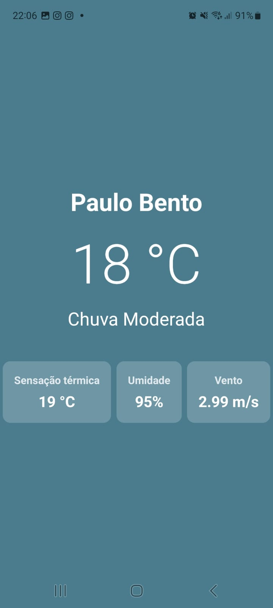

### App básico para mostrar a prevsão do tempo conforme a localização

* **Framework:** React Native (com Expo)
* **Linguagem:** JavaScript
* **Localização:** expo-location
* **HTTP Client:** axios
* **API Externa:** OpenWeatherMap

### 🗺️ Imagem do app
